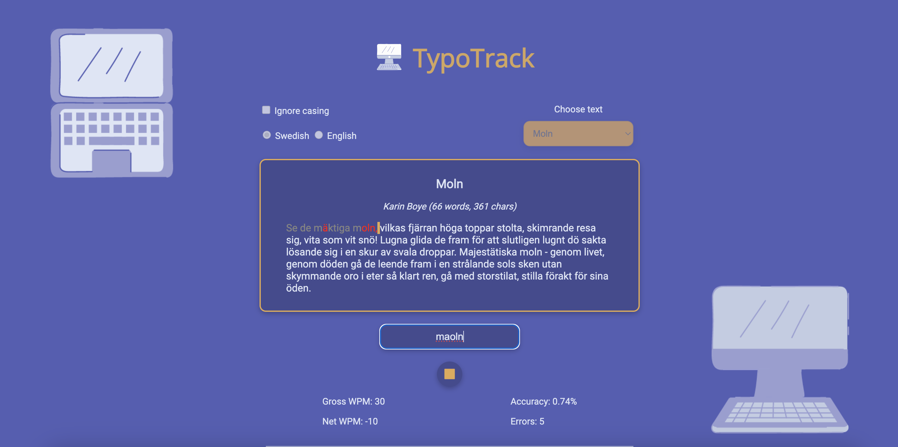

# TypoTrack: Interactive Typing Assistant

## Overview

Welcome to TypoTrack! It is an immersive typing assistant designed to improve your typing skills while providing a delightful and engaging user experience. TypoTrack challenges users to type accurately and efficiently, offering real-time statistics, text casing checks, and personalized feedback to enhance learning and performance.

## Features

- **Real-Time Statistics**

Gain insights into your typing performance with live updates on your speed, accuracy, and typing patterns.

- **Text Casing Sensitivity**

Choose to enforce text casing during typing exercises, adding an extra layer of challenge and learning.

- **Custom Fonts**

Enjoy a visually pleasing typing experience with two specially imported fonts, enhancing readability and user engagement.

- **Auditory Feedback**

Receive immediate sound notifications upon making a mistake, helping you identify and correct errors instantly.

## Technologies

TypoTrack is built using the foundational web development technologies:

- **HTML:** Structuring the core content and layout of the application.
- **CSS:** Styling the application with custom designs, including the integration of unique fonts for an enhanced user experience.
- **JavaScript:** Driving the application's interactivity, real-time performance tracking, and dynamic feedback mechanisms.

## Deployed project

The deployed project can be accessed via this link: (a link to the project)

Checking correctness:

## To run TypoTrack locally

**Setup**

1. Clone the repository: **`git clone https://github.com/nancy-anastasia/frontend-portfolio.git`**

2. Navigate to the project directory: **`cd frontend-portfolio`** and then **`cd project_02_typotrack`**

3. Open the **`index.html`** file in your browser to start the application.

No additional installation is required, as TypoTrack runs purely on client-side technologies.

## How to Use the Application

1. Choose the text option and casing sensitivity option, then click on the play button

2. Start typing the displayed text in the designated area

3. Your performance statistics will update in real time

4. Monitor your progress by keeping an eye on real-time statistics and typing feedback

5. Pay attention to the sound cues to quickly recognize your typing errors
