# Frontend Portfolio

## Introduction

Welcome to my Frontend Portfolio Repository!

This repository serves as a showcase of my skills and capabilities in frontend development, featuring three distinct projects that demonstrate my proficiency with modern web technologies. Each project within this portfolio is built with a focus on responsive design, user experience, and leveraging the full potential of **HTML**, **CSS**, **JavaScript**, **React**, **TypeScript**, **React Router**, **Redux**, **Redux Toolkit**, **Node.js (Express.js)**, and **Chakra UI** among other tools.

**Gamepedia** is a dynamic game catalog leveraging the rawg.io API to provide real-time data on a vast array of video games, highlighting my skills in API integration and responsive UI design.

**TypoTrack** offers an interactive typing experience, designed to improve typing skills with real-time feedback, showcasing my proficiency in developing web tools focused on user needs.

**UrbanGear Shop** is a modern online store showcasing my expertise in responsive UI design and state management using Redux, featuring a dynamic product grid, a sliding navigation drawer, and a fully functional shopping cart with real-time updates.

These projects are testament to my commitment to clean code, thoughtful design, and the creation of engaging, user-friendly web applications. Whether you're a fellow developer, a potential employer, or just a tech enthusiast, I invite you to explore these projects to get a sense of my approach to problem-solving and design in the realm of frontend development.

## Project List

### 1. Gamepedia

Deployed Project: [https://gamepedia-five.vercel.app/](https://gamepedia-five.vercel.app/)

**Technologies Used:**

- React
- TypeScript
- Chakra UI
- rawg.io API

Gamepedia is a dynamic web application that serves as a comprehensive catalog for video games, allowing users to sort and filter games by various criteria and access detailed information fetched from the rawg.io API.

1. Sorting games by genre, platform and other features

- In dark mode:

- In light mode:

2. Searching for a game by title on Gamepedia

### 2. TypoTrack

Deployed Project: [https://typotrack.vercel.app/](https://typotrack.vercel.app/)

**Technologies Used:**

- HTML
- JavaScript
- CSS

TypoTrack is an interactive typing application designed to enhance and evaluate users' typing skills, providing real-time feedback on speed and accuracy, and supporting texts in both English and Swedish.

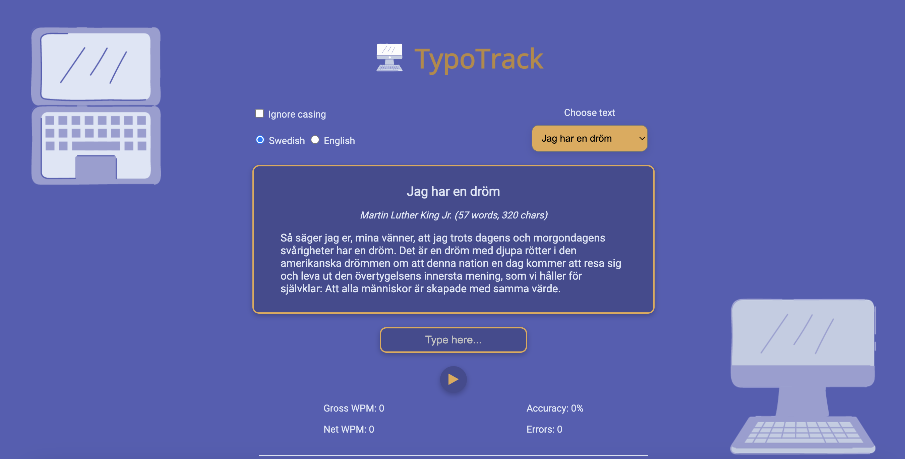

Checking correctness and displaying statistics:

### 3. UrbanGear Shop

Deployed Project: [https://urbangear-shop-frontend.vercel.app/](https://urbangear-shop-frontend.vercel.app/)

**Technologies Used:**

- React (JSX)
- React Router
- React Redux v6
- Redux Toolkit
- Node.js (Express.js)
- CSS
- Font Awesome Icons

UrbanGear Shop is a modern web application that functions as an intuitive online store, enabling users to browse a dynamic product grid, utilize a sliding navigation drawer, and manage a fully responsive shopping cart, all powered by state management with Redux.

**Features:**

- Animated Product Cards
- Responsive Product Grid
- Dynamic Shopping Cart Badge
- Well-Designed Product Overview Page
- Fully Functional Shopping Cart
- Persistent Shopping Cart Data
- Sliding Navigation Drawer

#### 1. Homepage with Product Grid

- Animation of product cards on hover

- Homepage displayed on a desktop screen

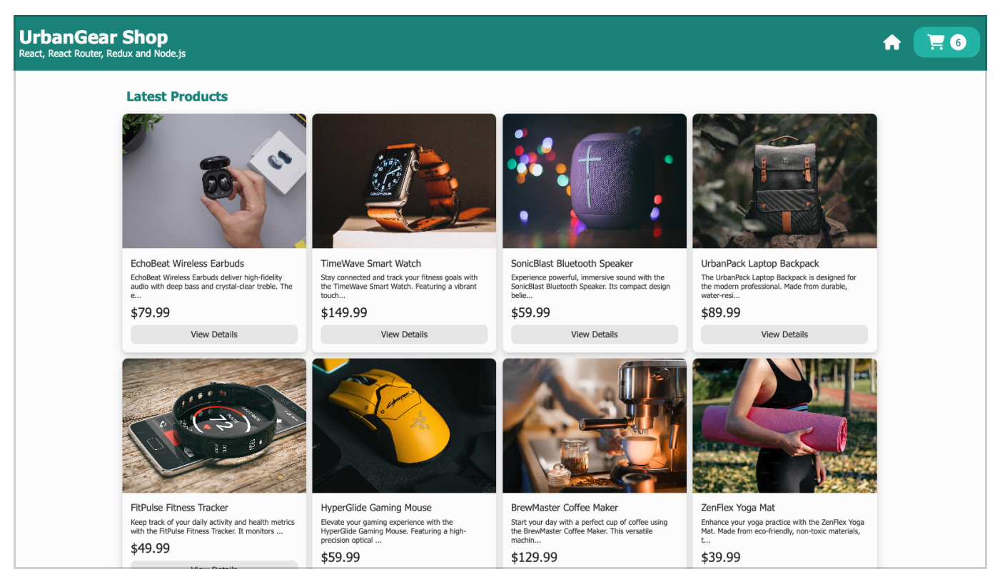

- The desktop view of the homepage with a product card in focus

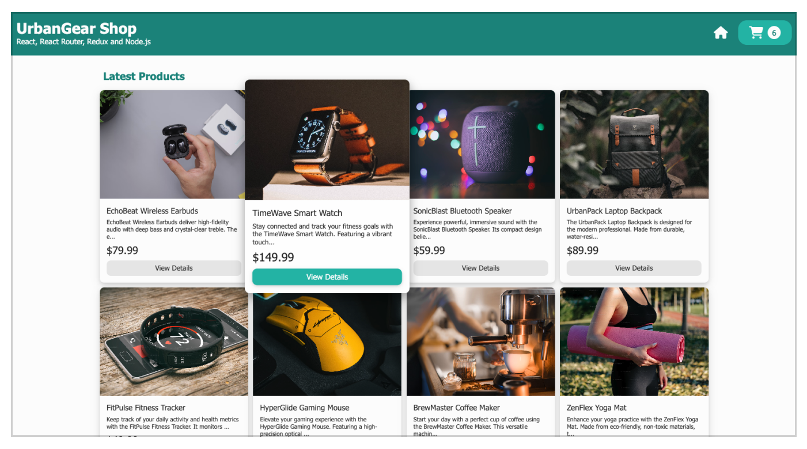

- A preview of the homepage on a tablet

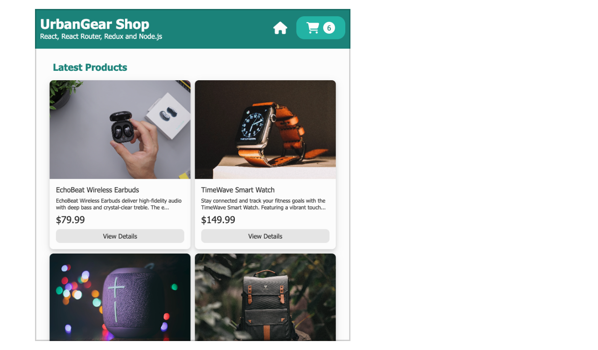

- A preview of the homepage on a phone

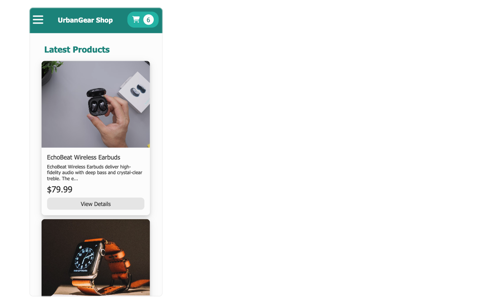

#### 2. Product Page

- A product overview of a product in stock

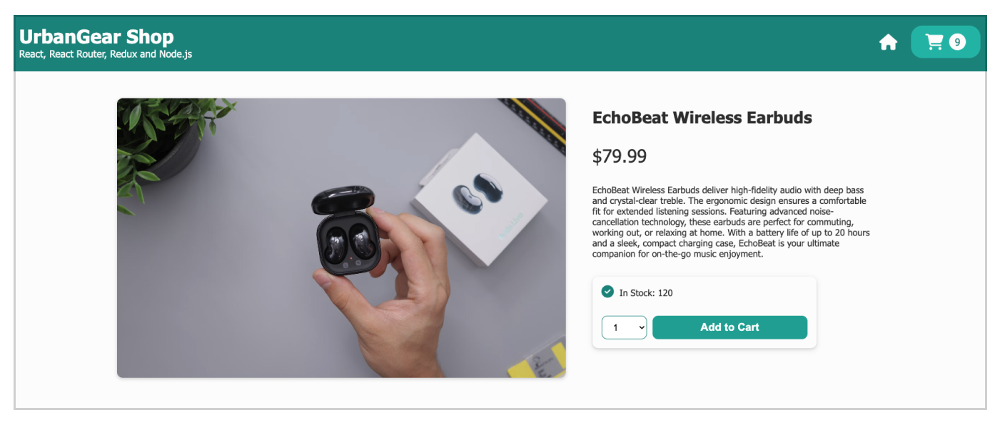

- A product overview of a product out of stock

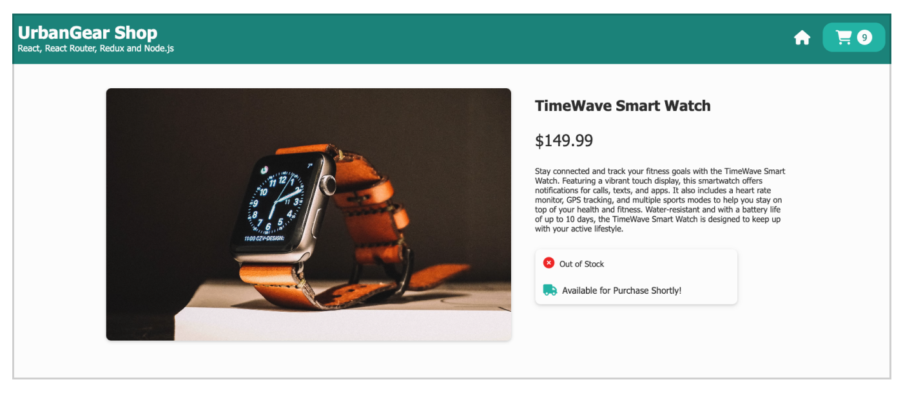

- A product overview on a tablet

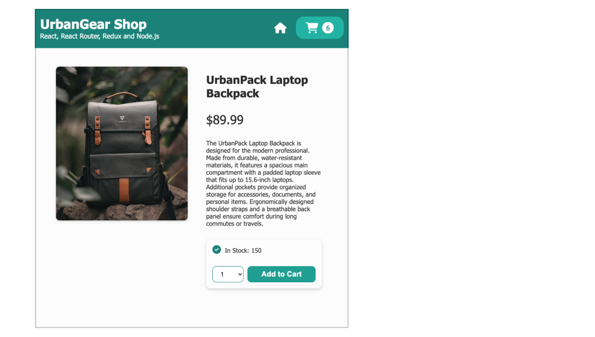

- A product overview on a phone

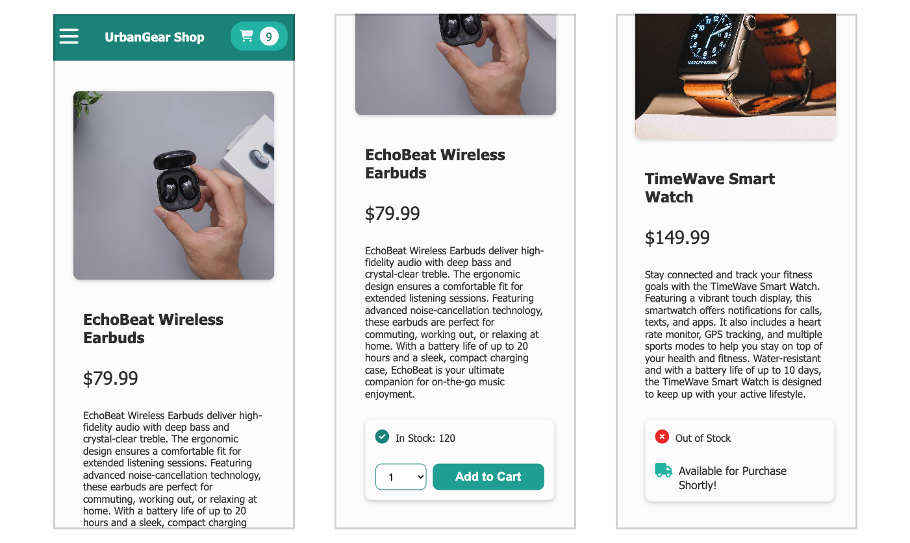

#### 3. Shopping Cart

- The desktop view of the shopping cart

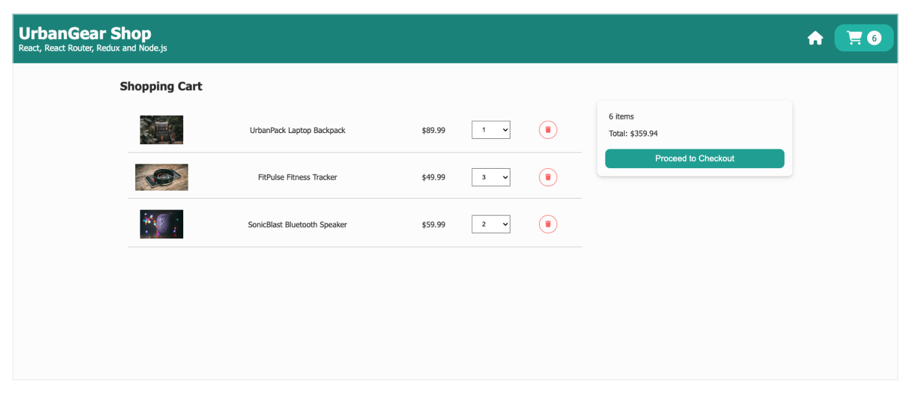

- A shopping cart overview on a tablet

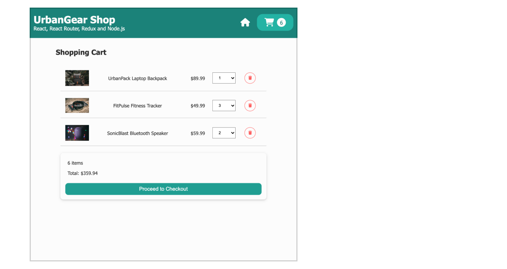

- A shopping cart overview on a phone

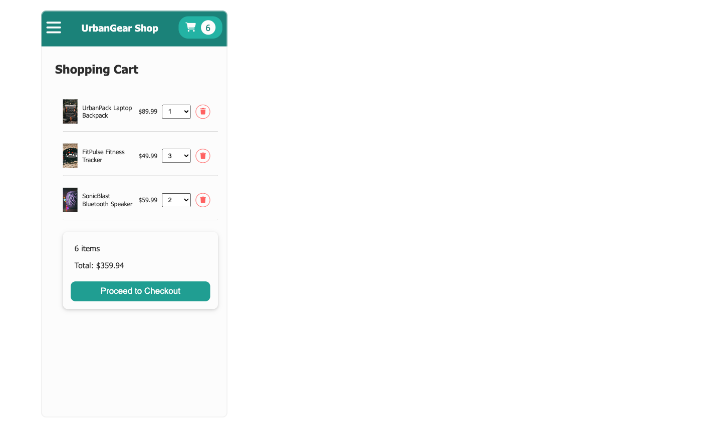

#### 4. Navigation Drawer

- Navigation drawer on mobile devices

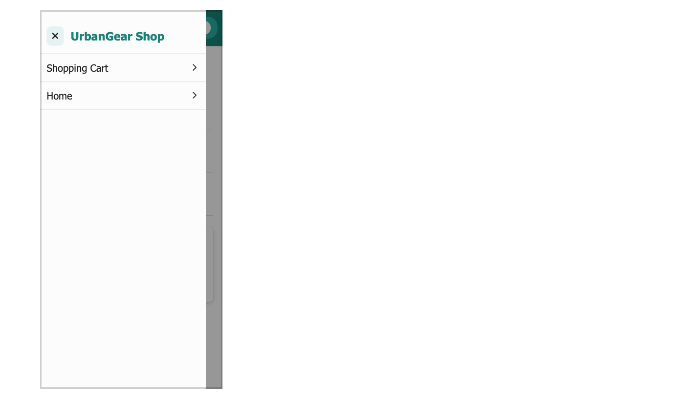

## To run the projects locally

To explore and run the projects in this portfolio locally, follow these general steps:

1. First, clone this repository to your local machine using the following command:

   **`git clone https://github.com/nancy-anastasia/frontend-portfolio.git`**

2. Navigate to the Project Directory

- For "Gamepedia":

  **`cd frontend-portfolio`** and then **`cd project_01_gamepedia`**

- For "TypoTrack":

  **`cd frontend-portfolio`** and then **`cd project_02_typotrack`**

- For "UrbanGear Shop":

  **`cd frontend-portfolio`** and then **`cd project_03_urbangear_shop`**

3. Follow the instructions in the README files for corresponding projects.
