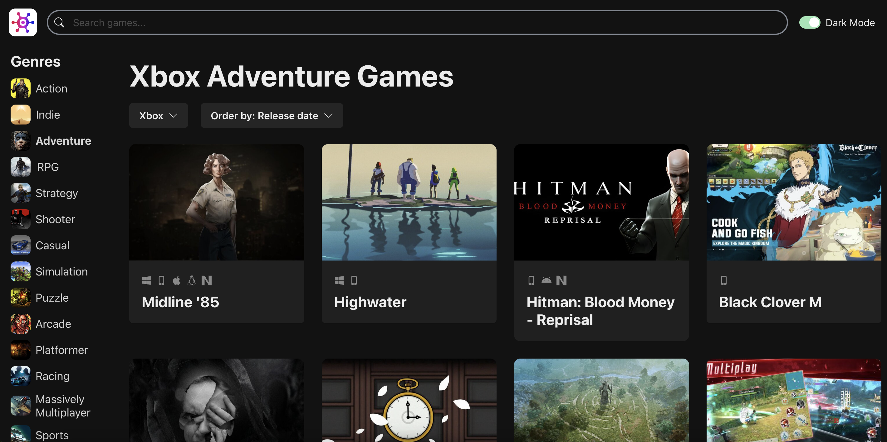
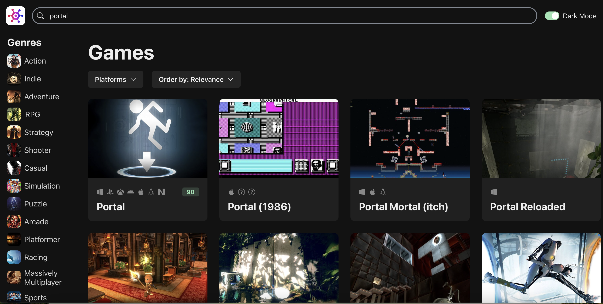

# Frontend Portfolio

## Introduction

Welcome to my Frontend Portfolio Repository!

This repository serves as a showcase of my skills and capabilities in frontend development, featuring two distinct projects that demonstrate my proficiency with modern web technologies. Each project within this portfolio is built with a focus on responsive design, user experience, and leveraging the full potential of HTML, CSS, JavaScript, React, TypeScript, and Chakra UI among other tools.

**Gamepedia** is a dynamic game catalog leveraging the rawg.io API to provide real-time data on a vast array of video games, highlighting my skills in API integration and responsive UI design.

**TypoTrack** offers an interactive typing experience, designed to improve typing skills with real-time feedback, showcasing my proficiency in developing web tools focused on user needs.

Both projects are testament to my commitment to clean code, thoughtful design, and the creation of engaging, user-friendly web applications. Whether you're a fellow developer, a potential employer, or just a tech enthusiast, I invite you to explore these projects to get a sense of my approach to problem-solving and design in the realm of frontend development.

## Project List

### Gamepedia

Deployed Project: [https://gamepedia-five.vercel.app/](https://gamepedia-five.vercel.app/)

**Technologies Used:**

- React
- TypeScript
- Chakra UI
- rawg.io API

Gamepedia is a dynamic web application that serves as a comprehensive catalog for video games, allowing users to sort and filter games by various criteria and access detailed information fetched from the rawg.io API.

Sorting games by genre, platform and other features:

Searching for a game by title on Gamepedia:

### TypoTrack

Deployed Project: [https://typotrack.vercel.app/](https://typotrack.vercel.app/)

**Technologies Used:**

- HTML
- JavaScript
- CSS

TypoTrack is an interactive typing application designed to enhance and evaluate users' typing skills, providing real-time feedback on speed and accuracy, and supporting texts in both English and Swedish.

Checking correctness and displaying statistics:

## To run the projects locally

To explore and run the projects in this portfolio locally, follow these general steps:

1. First, clone this repository to your local machine using the following command:

**`git clone https://github.com/nancy-anastasia/frontend-portfolio.git`**

2. Navigate to the Project Directory

For "Gamepedia":

**`cd frontend-portfolio`** and then **`cd project_01_gamepedia`**

For "TypoTrack":

**`cd frontend-portfolio`** and then **`cd project_02_typotrack`**

3. Follow the instructions in the README files for corresponding projects.
