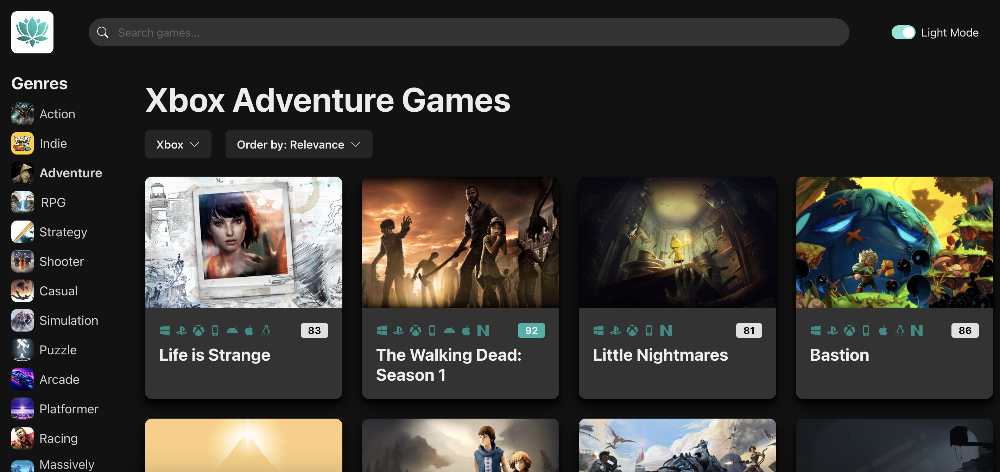
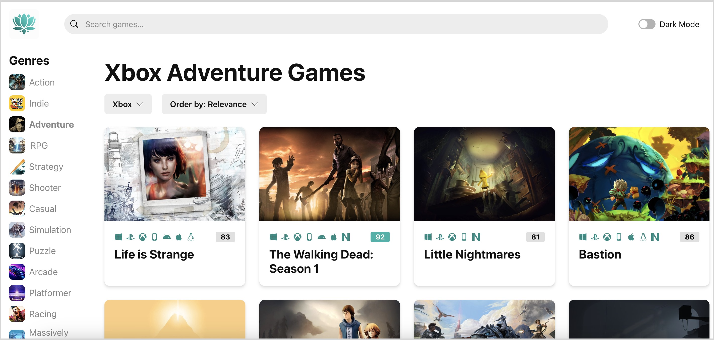
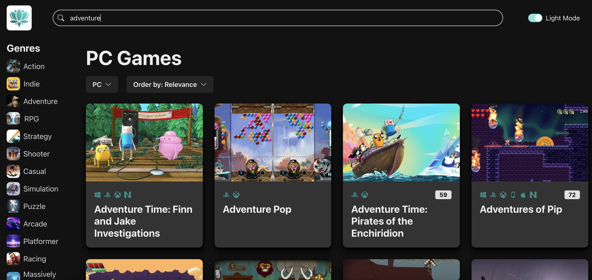

# Gamepedia: React + TypeScript + ChakraUI

## Overview

Gamepedia is a dynamic web application designed as a comprehensive catalog for video games, enabling users to explore an extensive collection of games. The application allows for convenient sorting and filtering by genre, release date, title, and more, providing an interactive and engaging user experience.

## Features

- **Dynamic Game Catalog**

Browse through a vast collection of video games, with real-time data fetched from the rawg.io API.

- **Advanced Filtering**

Easily filter games by genre, release date, title, and more to find exactly what you're looking for.

- **Responsive Design**

Enjoy a seamless experience on any device, thanks to a mobile-first approach and responsive layouts.

## Technologies

- **React:** Utilized for building the user interface with component-based architecture.
- **TypeScript:** Employed for adding static type definitions to enhance code quality and reliability.
- **Chakra UI:** Used for styling components with a focus on responsiveness and accessibility.
- **rawg.io API:** Integrated for fetching up-to-date game information, including genres, images, titles, and scores.

## Deployed project

The deployed project can be accessed via this link: [https://gamepedia-five.vercel.app/](https://gamepedia-five.vercel.app/)

1. Sorting games by genre, platform and other features

- In dark mode:

- In light mode:

2. Searching for a game by title on Gamepedia

## To run Gamepedia locally

### Prerequisites

Ensure you have Node.js installed on your computer.

### Installation

1. Clone the repository: **`git clone https://github.com/nancy-anastasia/frontend-portfolio.git`**

2. Navigate to the project directory: **`cd frontend-portfolio`** and then **`cd project_01_gamepedia`**

3. Install dependencies: **`npm install`**

4. To run the application locally, execute **`npm run dev`**

5. This will launch the application in development mode. Open http://localhost:5173/ to view it in the browser.
