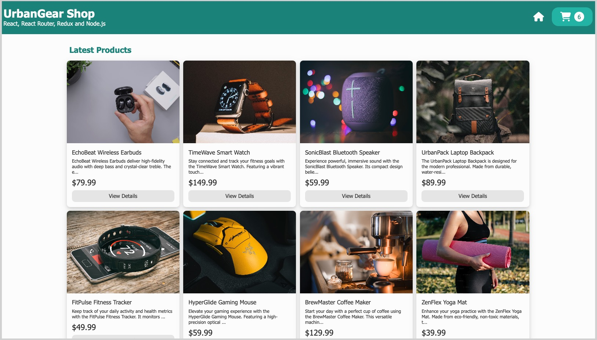
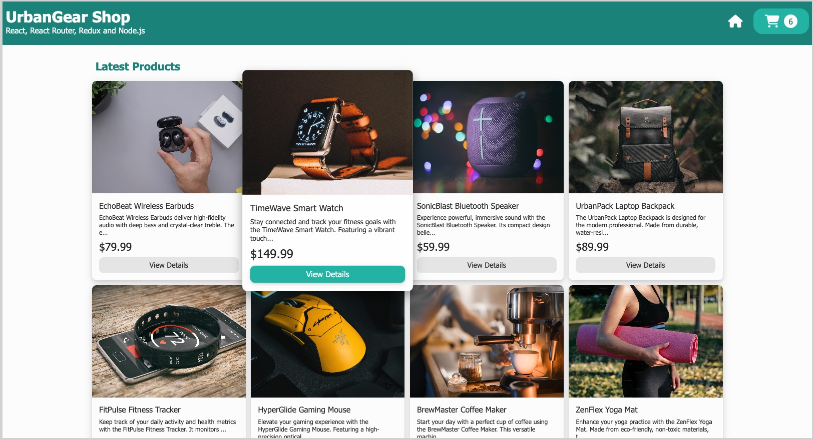
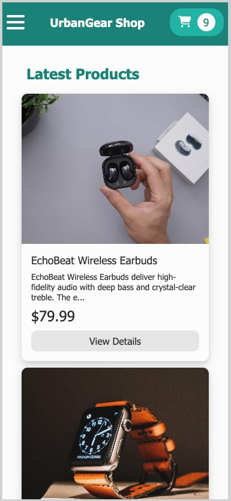
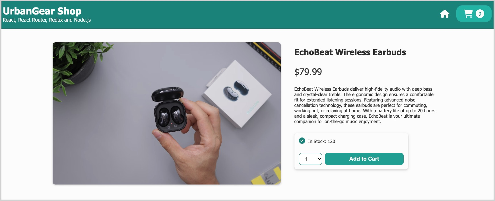
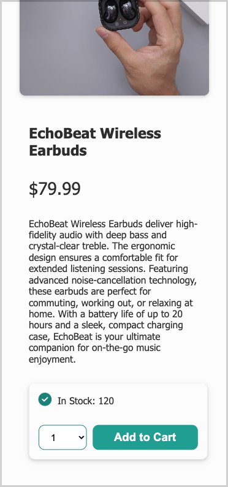
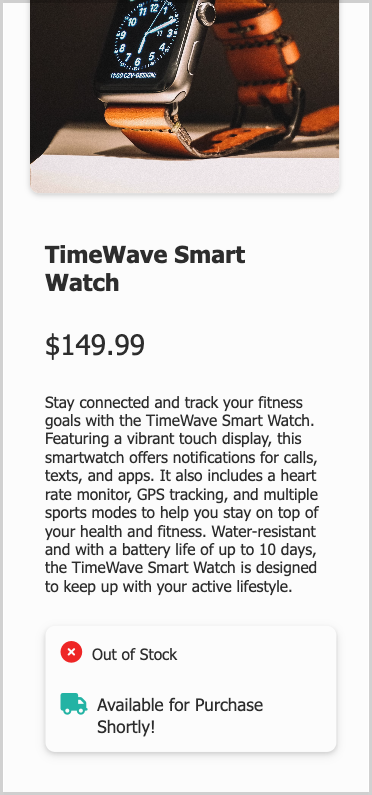
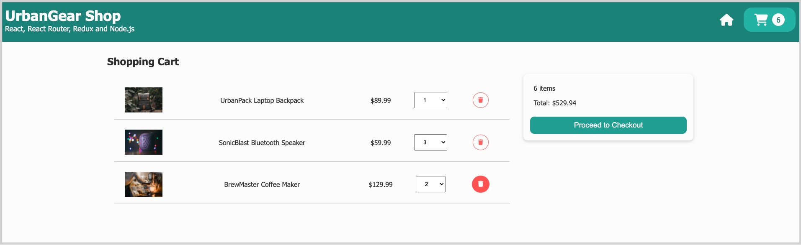
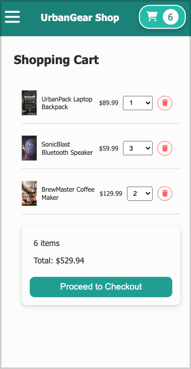
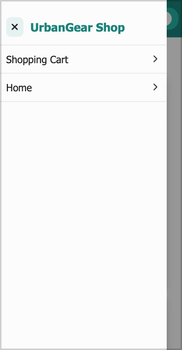

# UrbanGear Shop: React, React Router, Redux, Node.js/Express.js

## Overview

UrbanGear Shop is a modern web application designed to offer a seamless online shopping experience. The platform features a clean and intuitive design, showcasing a well-organized product grid with smooth animations on hover, enhancing the overall user engagement. The application includes detailed product overview pages, a fully functional shopping cart, and a dynamic cart badge that updates in real-time as items are added. With a responsive design, UrbanGear Shop ensures an optimal shopping experience across all devices, from large desktop screens to tablets and mobile phones.

## Features

- **Animated Product Cards**

Enjoy a smooth and engaging user experience with hover animations on product cards within the product grid, adding a dynamic touch to browsing.

- **Responsive Product Grid**

Experience seamless transitions across different screen sizes, with a fully responsive product grid that looks great on both desktop and mobile devices.

- **Dynamic Shopping Cart Badge**

Stay informed with a shopping cart badge that updates in real-time as items are added, displaying the total number of products in your cart.

- **Well-Designed Product Overview Page**

Explore product details on a fully responsive product overview page, which dynamically updates stock status and integrates a convenient "Add to Cart" button.

- **Fully Functional Shopping Cart**

Manage your cart with ease, including the ability to update product quantities and remove items with a single click, ensuring a hassle-free shopping experience.

- **Persistent Shopping Cart Data**

Your shopping cart data is securely saved in the browser, allowing you to seamlessly continue your shopping in future sessions without losing your selected items.

- **Sliding Navigation Drawer**

Enjoy smooth navigation on tablet and mobile devices with a sliding navigation drawer that provides easy access to different sections of the site, optimizing the mobile browsing experience.

## Technologies

- **React (JSX):** Utilized for building a dynamic and interactive user interface with a component-based architecture, ensuring seamless user experiences.
- **React Router:** Implemented to manage in-app navigation, providing smooth transitions and deep linking between pages.
- **React Redux v6:** Employed to manage the global state of the application, ensuring consistent data flow across components.
- **Redux Toolkit:** Integrated to simplify the setup and management of Redux state, improving code efficiency and maintainability.
- **Node.js (Express.js):** Used for building the backend API, handling server-side logic, and managing requests efficiently.
- **CSS:** Applied for custom styling, ensuring a visually appealing and responsive design across all devices.
- **Font Awesome Icons:** Incorporated to enhance the UI with a wide range of scalable vector icons, adding visual clarity and emphasis to key elements.

## Deployed Project

**The deployed project can be accessed via this link:** (link)

### 1. Homepage with Product Grid

- Animation of product cards on hover

- Homepage displayed on a desktop screen

- The desktop view of the homepage with a product card in focus

- A preview of the homepage on a tablet

- A preview of the homepage on a phone

### 2. Product Page

- A product overview of a product in stock

- A product overview of a product out of stock

- A product overview on a tablet

- A product overview on a phone

### 3. Shopping Cart

- The desktop view of the shopping cart

- A shopping cart overview on a tablet

- A shopping cart overview on a phone

### 4. Navigation Drawer

- Navigation drawer on mobile devices

## To Run UrbanGear Shop Locally

### Prerequisites

Ensure you have Node.js installed on your computer.

### Installation

1. Clone the repository: **`git clone https://github.com/nancy-anastasia/frontend-portfolio.git`**

2. Navigate to the project directory: **`cd frontend-portfolio`** and then **`cd project_03_urbangear_shop`**

3. Before running the application, you need to set up the necessary environment variables:

- Copy the **`.env.example`** file to a new file named **`.env`** in the root directory: **`cp .env.example .env`**

- Open the **`.env`** file and replace the placeholders with your actual configuration details:

  - **`user:<password>`**: Replace **`<password>`** with your database user password
  - **`<cluster-url>`**: Replace this with your MongoDB cluster URL
  - **`<dbname>`**: Replace this with the name of your MongoDB database
  - **`<app-name>`**: Optionally, replace this with your application name as registered in MongoDB

4. Install dependencies: **`npm install`**

5. To run the application locally, execute **`npm run dev`**. This will launch the application in development mode.

6. Open http://localhost:3000/ (or whichever port you have configured) to view it in the browser.

#### Data Import

To import or seed data into your database, run: **`npm run data/import`**
